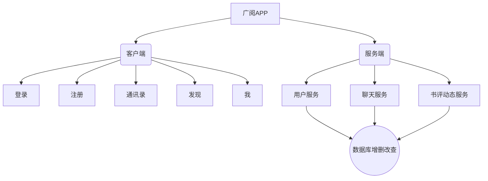
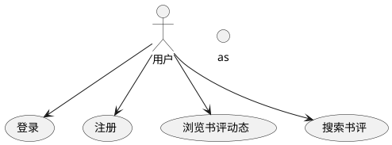

```mermaid

graph TB;
    A[广阅APP]-->B(客户端);
    A-->C(服务端);
    B-->D[登录];
    B-->E[注册];
    B-->F[通讯录];
    B-->G[发现];
    B-->H[我];
    C-->J[用户服务]
    C-->K[聊天服务]
    C-->L[书评动态服务]
    J-->M((数据库增删改查))
    K-->M
    L-->M

```

```puml
@startuml
:用户: as user
(登录) as login
(注册) as register
(浏览书评动态) as moment
(搜索书评) as search
() as
user --> login
user --> register
user --> moment
user --> search
@enduml
```